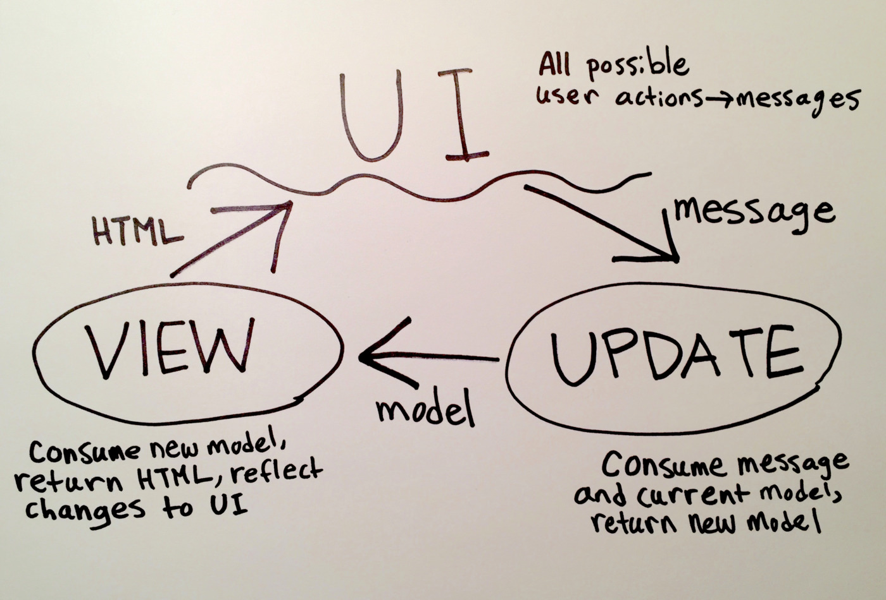

# Our First Full Feature

While emojis are great, a one-way translator from text to emojis is not particularly useful. We need to be able translate in both directions, like this:


This is a complex feature — to implement it, we'll have to change every part of our application. Let's get started!

Note: Your code should currently [look like this](https://github.com/elmbridge/elmoji-translator/tree/release-2). You can either carry your code over from the last lesson, or download and recompile [the code from GitHub.](https://github.com/elmbridge/elmoji-translator/releases/tag/release-2)


## Goals

  - Write Elm view code using HTML as a template.
  - Add a new message for your application to consume.
  - Extend a type alias and fix subsequent compiler errors.
  - Use union types to store information in more literate ways.

## Steps

### Adding User Interfaces

 First, let's start in `View.elm`, where we'll map user actions in the UI to messages for our application to consume.


In our case, we want to build a switch that will allow users to toggle between "Translate Text" and "Translate Emoji." We can use the [materialize.css](http://materializecss.com/) lever component to do the job. Between the text input and paragraph tag that our `View.view` function produces, we want the following markup to appear:

```html
<div class="switch center">
  <label>
    Translate Text
    <input type="checkbox"></input>
    <span class="lever"></span>
    Translate Emoji
  </label>
</div>
```

Take a shot at translating the above HTML to Elm and update the `View.view` function! Some tips if you get stuck:
  - Most `Html` functions take two arguments: a list of attributes (produced by the `Html.Attributes` and the `Html.Events` modules), followed by a list of child elements. In this case, our `div` has one child (the `label` element), and the `label` element has four children!
  - To render plain text elements, use `Html.text`. It simply takes a string as its argument.
  - Compile early and often! The Elm compiler will nudge you in the right direction if your syntax is off.

If you get stuck, flag down a TA or instructor to help you through it! Alternatively, you can see [a working solution here](https://github.com/elmbridge/elmoji-translator/tree/release-3-part-1).

### Wiring in User Actions

Now that we have a working lever, we need to wire it up to our `Update.update` function! Let's look at our `Update.elm` file, and see what messages our `Update.update` function can currently consume.

```elm
type Msg
    = SetCurrentText String
```

This is a **union type declaration**. It defines a new type that we can use in our program, along with all its possible **values**. Specifically, the above code defines the `Msg` type, and declares that it has exactly one possible value – `SetCurrentText String`, which is triggered whenever the user inputs text into the translation box.

Even though union types and values look similar, they operate in different parts of our program. A union type is just another type, like `String` or `List`, which we can use in our type signatures. Values, on the other hand, can only be used in our implementation code. For instance:

We can use the `case pet of` syntax to **Pattern Match** to branch our code based on which **value** of the **type** we receive.


```elm
type Pet = Cat | Dog | Rabbit | Turtle
-- this defines the union type `Pet` with four possible values

makeSound : Pet -> String
-- union types, like `Pet`, can only be used in type signatures.
makeSound pet =
    -- values like `Cat` and `Dog` can't be used in type signatures,
    -- but they can be used inside functions.
    if pet == Cat
        "meow"
    else if pet == Dog
        "woof"
    else
        "..silence.."
```

You may be wondering what the `String` means after `SetCurrentText`. This is the syntax for declaring a **tagged value**, which we will learn more about in a future lesson. For now, know that a use of `SetCurrentText` must also include a string to be considered a valid message:

```elm
-- valid value for `Msg`
SetCurrentText "some awesome text"

-- invalid values for `Msg`
SetCurrentText 12345
SetCurrentText "string one" "string two"
```

Back to the task at hand: in order for the user to toggle between translation modes, we need a new message to our system. Let's add another possible value to our `Msg` union type declaration:

```elm
type Msg
    = SetCurrentText String
    | ToggleDirection
```

We'll make sure our lever triggers the new `ToggleDirection` `Msg` whenever the user clicks it!

If you try to compile now, you'll notice that the compiler realizes something is wrong:

```
-- MISSING PATTERNS --------------------------------------------- ././Update.elm

This `case` does not have branches for all possibilities.

13|>    case msg of
14|>        SetCurrentText newText ->
15|>            { model | currentText = newText }

You need to account for the following values:

    Update.ToggleDirection

Add a branch to cover this pattern!
```

Helpfully, the Elm compiler enforces **case exhaustiveness** – since our `Update.update` function doesn't handle our new `ToggleDirection` value, the compiler realizes that triggering that `Msg` will break our program. Let's fix it by adding another clause to our case expression, this time matching on the pattern `ToggleDirection`.

```elm
ToggleDirection ->
    -- currently, this does nothing!
    model
```

Finally, let's make our view actually trigger our new `Msg` value. Add the following attribute to the lever's HTML in `View.view`:

```elm
Html.Events.onClick Update.ToggleDirection
```

Compile, and make sure nothing is broken! If you want, you can see [a working solution here](https://github.com/elmbridge/elmoji-translator/tree/release-3-part-1).

### Expanding the Model

When our `Update.update` function receives a `ToggleDirection` message and the current `model`, it should return a new, changed `model`:


Eventually, our `View.view` function will reflect those changes to the user.

First things first — we need to find a way to describe the current direction in our `Model`. Let's take a look at `Model.elm`:

```elm
type alias Model =
    { currentText : String }
```

The code above declares that `Model` is a **type alias** for a specific record structure. A type alias works a lot like a union type declaration — it also produces a new type that we can use in our program. In this case, the `Model` type is just another name for "a record with a single field called `currentText`."

Type aliases are helpful for making type signatures simple and readable. For example, you can see that `Model` is used in the type signature for `init`:

```elm
init : Model
init =
    { currentText = "" }
```

Without this type alias, we would've had to write:

```elm
init : { currentText : String }
init =
    { currentText = "" }
```

Now back to business: we'll need to extend this type alias declaration, by adding another field to the record:

```elm
type alias Model =
    { currentText : String
    , direction: -- ????
    }
```

But wait, what *is* direction? In other languages, we might describe the current direction as a string, with possible values "emoji-to-text" and "text-to-emoji". We could also model it as a boolean value, perhaps renaming it `translatingTextToEmoji`.

In Elm, we have a more powerful tool at our disposal: union types! We can simply create a union type that enumerates all possible values for a direction, which keeps the code readable and fault tolerant. In `Model.elm`, let's create a custom `Direction` type with two possible values:

```elm
type Direction
    = TextToEmoji
    | EmojiToText
```

Now, we can use that new type in our `Model` type alias:

```elm
type alias Model =
    { currentText : String
    , direction : Direction
    }
```

If you try to compile right now, you should get some errors: Our code wasn't written to handle a `Model` with a `direction` field! See if you can figure out what's wrong and fix it.

Now that `Model` can describe the current translation direction, we need to change `Update.update` to correctly set the `direction` field when it consumes the `ToggleDirection` message.

Inside `Update.update`, we know two things – the current `Msg` we received, as well as the current state of the `model`, which includes its current `direction`. That's all the information we need – if the current `model.direction` is `EmojiToText`, `Update.update` should return a `model` with a `direction` value of `TextToEmoji`, and vice versa.

We can use `case ___ of` syntax to **Pattern Match** on the different values of the type `Direction`. This allows us to branch our code to handle the different conditions.

```elm
ToggleDirection ->
    case model.direction of
        Model.TextToEmoji ->
            -- return a model with a direction value of `Model.EmojiToText`

        Model.EmojiToText ->
            -- return a model with a direction value of `Model.TextToEmoji`
```

Implement the above code in `Update.update`, and make sure it compiles!

### Displaying Model Values

Now to the final part of the feature: We need to reflect changes to the model in the UI!



In our case, we need to change our translation logic depending on the current `model.direction`.  Let's take a look at our `View.translateText` function:

```elm
translateText model =
    EmojiConverter.textToEmoji Model.defaultKey model.currentText
```

Here's what we know:

- The `EmojiConverter` exposes a `emojiToText` function that we can use if the current direction is `Model.EmojiToText`.
- The `translateText` function also has access to the current `model`, which stores the current `Direction`.
- In a similar manner to `Update.update` function, we can use a case expression to choose which `EmojiConverter` function to use.

That should be enough to get you started! If you are unsure, try to compile, and follow compiler errors until everything is fixed. If you get stuck, you can see [a completed version of this feature here](https://github.com/elmbridge/elmoji-translator/releases/tag/release-3-part-2), or flag down a TA or instructor.

Congratulations, you've completed your first full feature in Elm!
