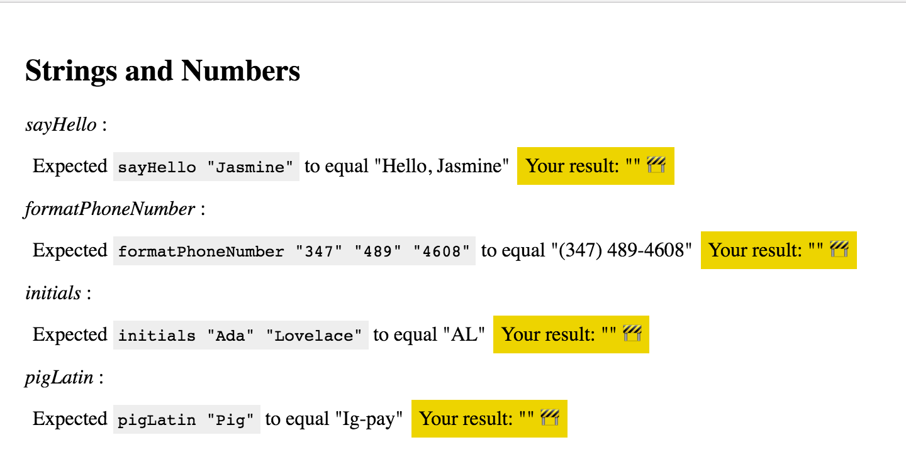

# The Basic Building Blocks of Elm

In this release, you'll learn how to work the the basic data structures of elm. You'll be working with a [custom application that we've written](https://github.com/elmbridge/intro-to-elm-part-1) where you'll be asked to implement some basic transformations.

## Goals

  - Practice defining and using functions in Elm
  - Learn how to use strings, lists, and records.

## Steps

### <input type="checkbox"> Step 1

Get a copy of the [intro-to-elm-part-1](https://github.com/elmbridge/intro-to-elm-part-1) code:

```bash
git clone https://github.com/elmbridge/intro-to-elm-part-1.git
cd intro-to-elm-part-1
```

Start Elm Reactor to build the project:

```bash
elm-reactor
```

Now open [http://localhost:8000/](http://localhost:8000/) in your web browser, and go to `Main.elm`.

You should see something like this:



This application contains a series of failing assertions. Your job will be to make them pass!

All the code for this application lives in `Main.elm`, and everything is customizable! Poke around, and change whatever you want!

### <input type="checkbox"> Step 2

Like many languages, elm has a **String** data type to store text. In this step, you should complete all the assertions for the string section of the application. Once you're ready to get started, navigate to the `sayHello` function.

```elm
sayHello friendsName =
    ""
```

You'll notice that this assertion is currently failing in your browser. Your job is to make it pass! Once you have a guess, change and save the code in `Main.elm` — refresh your browser and you'll learn if you implemented it correctly. If you've made a syntax error, the page will display an error message that will tell you what to fix.

You should have enough to get started! A few tips:

- Remember, the `++` operator is used to add strings together.
- If you want to transform a string in some way, you should use [the `String` module](http://package.elm-lang.org/packages/elm-lang/core/latest/String) to do so. For instance, if you wanted to get the last letter of a string, you might use the `String.right` function like this:

```elm
String.right 1 someStringVariable
```

If you get stuck, flag down an instructor! They are here to help.


### <input type="checkbox"> Step 3

In elm, you can use a **List** to store a collection of elements. Unlike dynamic languages, though, Elm lists are **typed** — every element in a list must the same kind of thing. You can't have a list that stores both strings and numbers, for example.

For this step, you should complete all the `List` assertions. Some tips:

- In another language, you might solve these assertions by creating an empty list, and incrementally adding things to it as you iterate over the passed-in list. That's not possible in elm — once you've declared a variable in Elm, you can never change it. You will have to use more complicated `List` functions, like `List.map`.
- Most common functions that operate on lists live in [the `List` module](http://package.elm-lang.org/packages/elm-lang/core/latest/List). The order of arguments to these functions may be disorienting — in functional programming languages, the convention is to have the data you are operating on be the *last* argument to a function, not the first.
- Many of these functions consume a function. To use them, you can use an anonymous function, like this:

```elm
  List.map (\list_element -> list_element * 2) [1,2,3]
```

Note: the value after the `\` is the input to the function, while whatever is after the `->` sign is the output.

Good luck!

### <input type="checkbox"> Step 4

Just like Ruby has hashes and JavaScript has objects, elm has **records** to store key-value pairs. Unlike those other languages, though, elm does not allow you to change the number of keys of a record after creation. A record with three keys always has three keys, no matter what.

Unlike strings and lists, records are a special data type that have a special syntax for getting and setting values. You can create a record like this:

```elm
aNewRecordAppears =
  { key = "value", anotherKey = 1111 }
``

To get the value out of a record, you can use `.` syntax:

```elm
aNewRecordAppears.key
```

And to update a specific attribute, you use `|` operator

```elm
{ aNewRecordAppears | key = "a new value for the specified key" }
```

There is no `Record` module — all record functions are implemented through special syntax. You can learn more about the type in [the official elm guide on records.](http://elm-lang.org/docs/records).
